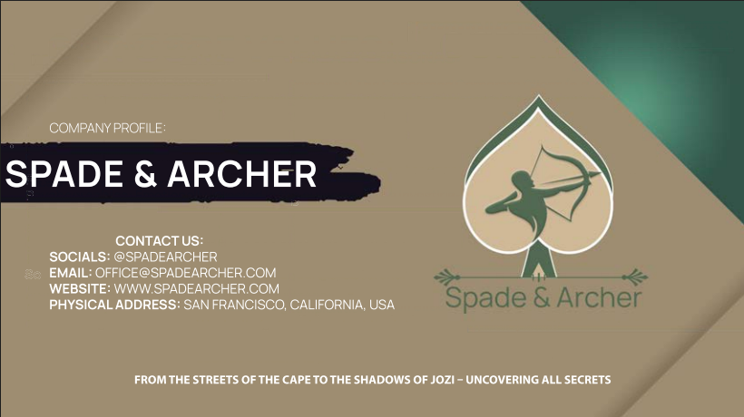

# Spade & Archer — Company Profile

## Description

A full professional company profile document designed for **Spade & Archer** — a private investigation firm operating across South Africa. The document positions the firm as trustworthy, professional, and results-driven while communicating its full range of services to prospective clients and partners.

The design challenge was translating a traditionally serious, confidential industry into a visually compelling and readable document without sacrificing the weight of authority the brand requires.

## Technologies Used

| Tool | Purpose |
|---|---|
| **Adobe InDesign** | Document layout, typography, and multi-page production |
| **Adobe Illustrator** | Custom icons, graphic elements, and brand accents |

## My Role

Brand Strategist & Document Designer — responsible for messaging strategy, visual design, and full document production from brief through to print-ready PDF.

## Document Contents

| Section | Description |
|---|---|
| **Cover & Introduction** | Brand overview and firm summary |
| **Mission & Vision** | Core purpose and future direction |
| **Core Values** | The principles guiding all operations |
| **Products & Services** | Full listing of investigation and security services |
| **Target Market Personas** | Key client profiles with demographic insights |
| **Contact Information** | Office locations and direct contact details |

## Installation Instructions

This is a print/digital document project — no code installation is required.

1. Download the Company Profile PDF from the link below.
2. Open with any PDF reader (Adobe Acrobat, a browser, or Preview on Mac).

**[Download Company Profile PDF](../../assets/Company_Profile_Spade_and_Archer.pdf)**

## Usage

The document is designed for:

- Client pitches and onboarding meetings
- Digital distribution via email or website download
- Print for corporate presentations and trade events

## Contributors

- **Marco Human** — Strategy, design, and copywriting

## License

MIT License — © 2025 Marco Human
