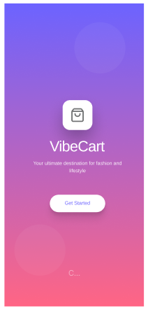
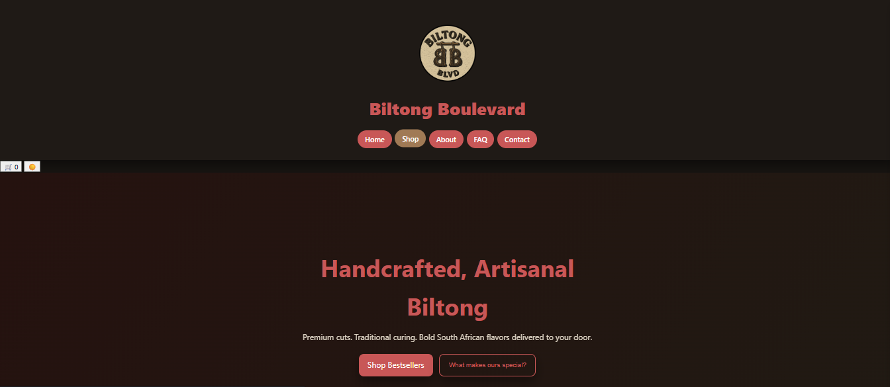
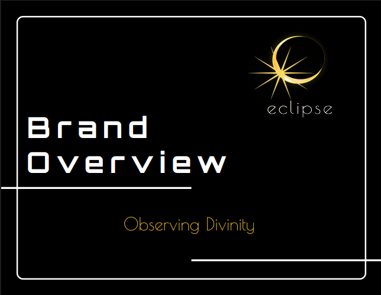

# Marco Human — ICT Multimedia Application Designer

<div align="center">


**Cape Town, South Africa · Available for Freelance Projects**

[](mailto:eclipsebymjh@gmail.com)
[](https://www.figma.com)
[](#)

</div>

---

## About Me

I'm an **ICT Multimedia Application Designer** with a passion for transforming complex ideas into clean, interactive digital experiences. From mobile apps to immersive web platforms, I bridge the gap between technology and creativity.

My process is rooted in **empathy** — understanding the end user before writing a single line of code or placing a single pixel. I collaborate closely with developers, stakeholders, and users to deliver products that are not just beautiful, but genuinely useful.

---

## Featured Projects

### 1. VibeCart — Mobile UI/UX Design

<a href="https://skillicons.dev">
  
</a>

| Detail | Info |
|---|---|
| **Role** | Lead UI/UX Designer |
| **Technologies** | Figma, Mobile UI Design |
| **Category** | App Design · E-Commerce |

A modern e-commerce home screen featuring personalized greetings, smart search, category navigation, daily deals, and trending products. Designed with a mobile-first approach to create an intuitive and engaging shopping experience.

**[View Full Project Details](./projects/vibecart/README.md)** &nbsp;|&nbsp; **[Live Figma Prototype](https://www.figma.com/proto/8tj8niEmRKnP3D1KATriZn/VibeCart?node-id=31-325&t=qXIGUrkR57Sx52mo-1)**



---

### 2. Droewors — Brand Website

<a href="https://skillicons.dev">
  
</a>

| Detail | Info |
|---|---|
| **Role** | Frontend Developer & Designer |
| **Technologies** | HTML5, CSS3, JavaScript |
| **Category** | Web Design |

A fully designed and developed brand website for a South African droewors product. Features product showcasing, brand identity integration, and a responsive mobile-first layout built with vanilla HTML, CSS, and JavaScript.

**[View Full Project Details](./projects/droewors/README.md)** &nbsp;|&nbsp; **[View Live Site](./droewors/Homepage.html)**



---

### 3. Eclipse Clothing — Brand Identity

<a href="https://skillicons.dev">
  
</a>

| Detail | Info |
|---|---|
| **Role** | Brand Strategist & Visual Designer |
| **Technologies** | Adobe Suite, Figma |
| **Category** | Branding |

A comprehensive brand identity system for Eclipse Clothing — a cosmic-inspired fashion label. Covers logo variations, colour palette, typography hierarchy, brand personality, logo usage guidelines, digital and print specifications, and apparel mockups.

**[View Full Project Details](./projects/eclipse-clothing/README.md)** &nbsp;|&nbsp; **[View Brand Guide PDF](./assets/BusinessY-BrandGuide.pdf)**



---

### 4. Spade & Archer — Company Profile

<a href="https://skillicons.dev">
  
</a>

| Detail | Info |
|---|---|
| **Role** | Brand Strategist & Document Designer |
| **Technologies** | Adobe InDesign, Brand Strategy |
| **Category** | Branding · Company Profile |

A full company profile document for Spade & Archer, a private investigation firm operating across South Africa. Includes mission statement, core values, products and services, target market personas, and contact information.

**[View Full Project Details](./projects/spade-archer/README.md)** &nbsp;|&nbsp; **[View Company Profile PDF](./assets/Company_Profile_Spade_and_Archer.pdf)**


---

## Technical Skills

### Design Tools

<a href="https://skillicons.dev">
  
</a>

| Discipline | Skills |
|---|---|
| **UI / UX** | User research, journey mapping, wireframes, prototypes, design systems |
| **Motion Graphics** | UI animation, brand films, explainers, social media content |
| **Brand Identity** | Logo design, colour systems, typography, brand guidelines |
| **3D & AR/VR** | 3D modelling, spatial computing concepts, immersive design |

### Development

<a href="https://skillicons.dev">
  
</a>

| Language / Framework | Level |
|---|---|
| HTML5 / CSS3 / JavaScript | Advanced |
| React / Vue / Next.js | Intermediate |
| Flutter | Intermediate |

---

## Repository Structure

```
Marco-Human-Portfolio/
│
├── README.md                          ← You are here
├── LICENSE
│
├── projects/
│   ├── vibecart/README.md             ← VibeCart project details
│   ├── droewors/README.md             ← Droewors project details
│   ├── eclipse-clothing/README.md     ← Eclipse Clothing project details
│   └── spade-archer/README.md         ← Spade & Archer project details
│
├── droewors/                          ← Live website source code
│   └── Homepage.html
│
├── assets/                            ← PDF documents
│   ├── BusinessY-BrandGuide.pdf
│   └── Company_Profile_Spade_and_Archer.pdf
│
└── images/                            ← Project screenshots
    ├── VibeCart.png
    ├── droewors-preview.png
    ├── Eclipse.png
    └── SpadeandArcher.png
```

---

## Contact

| | |
|---|---|
| **Email** | [eclipsebymjh@gmail.com](mailto:eclipsebymjh@gmail.com) |
| **Location** | Cape Town, South Africa |
| **Phone** | +27 72 585 9185 *(Mon–Fri, 9am–6pm SAST)* |
| **Available for** | Remote & on-site work worldwide |

---

## License

This portfolio and its contents are shared under the [MIT License](./LICENSE).  
© 2025 Marco Human · Eclipse Studio · Cape Town
