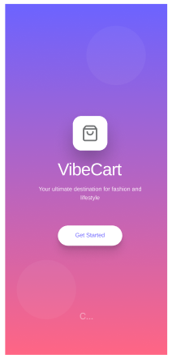
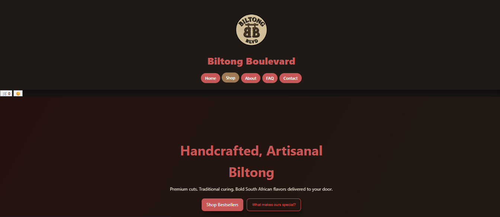
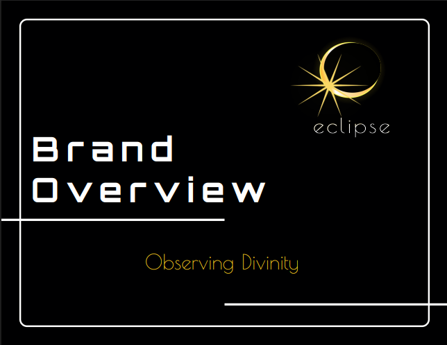
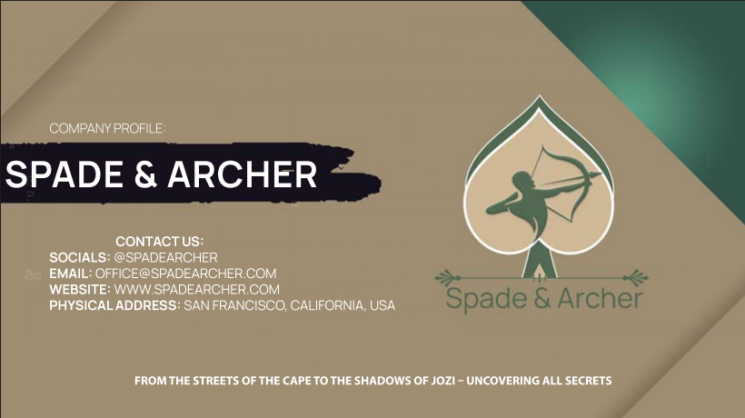
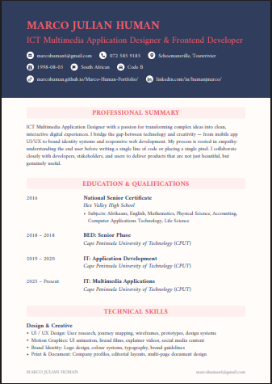

# Marco Human — ICT Multimedia Application Designer

**Cape Town, South Africa · Available for Freelance Projects**

---

## About Me

I'm an **ICT Multimedia Application Designer** with a passion for transforming complex ideas into clean, interactive digital experiences. From mobile apps to immersive web platforms, I bridge the gap between technology and creativity.

My process is rooted in **empathy** — understanding the end user before writing a single line of code or placing a single pixel. I collaborate closely with developers, stakeholders, and users to deliver products that are not just beautiful, but genuinely useful.

---

## Featured Projects

### 1. VibeCart — Mobile UI/UX Design

| Detail | Info |
|---|---|
| **Role** | Lead UI/UX Designer |
| **Technologies** | Figma, Mobile UI Design |
| **Category** | App Design · E-Commerce |

A modern e-commerce home screen featuring personalized greetings, smart search, category navigation, daily deals, and trending products. Designed with a mobile-first approach to create an intuitive and engaging shopping experience.

**[View Full Project Details](./projects/Vibe-Cart/README.md)** &nbsp;|&nbsp; **[Live Figma Prototype](https://www.figma.com/proto/8tj8niEmRKnP3D1KATriZn/VibeCart?node-id=31-325&t=qXIGUrkR57Sx52mo-1)**

---

### 2. Biltong BLVD — Brand Website

| Detail | Info |
|---|---|
| **Role** | Frontend Developer & Designer |
| **Technologies** | HTML5, CSS3, JavaScript |
| **Category** | Web Design |

A fully designed and developed brand website for a South African droewors product. Features product showcasing, brand identity integration, and a responsive mobile-first layout built with vanilla HTML, CSS, and JavaScript.

**[View Full Project Details](./projects/BiltongBlvd/README.md)** &nbsp;|&nbsp; **[View Live Site](./biltongblvd/Homepage.html)**

---

### 3. Eclipse Clothing — Brand Identity

| Detail | Info |
|---|---|
| **Role** | Brand Strategist & Visual Designer |
| **Technologies** | Adobe Suite, Figma |
| **Category** | Branding |

A comprehensive brand identity system for Eclipse Clothing — a cosmic-inspired fashion label. Covers logo variations, colour palette, typography hierarchy, brand personality, logo usage guidelines, digital and print specifications, and apparel mockups.

**[View Full Project Details](./projects/Eclipse-Brand-Guide/README.md)** &nbsp;|&nbsp; **[View Brand Guide PDF](./assets/BusinessY-BrandGuide.pdf)**

---

### 4. Spade & Archer — Company Profile

| Detail | Info |
|---|---|
| **Role** | Brand Strategist & Document Designer |
| **Technologies** | Adobe InDesign, Brand Strategy |
| **Category** | Branding · Company Profile |

A full company profile document for Spade & Archer, a private investigation firm operating across South Africa. Includes mission statement, core values, products and services, target market personas, and contact information.

**[View Full Project Details](./projects/Spade-and-Archer/README.md)** &nbsp;|&nbsp; **[View Company Profile PDF](./assets/Company_Profile_Spade_and_Archer.pdf)**

---
## Curriculum Vitae (CV)

**Download my full CV:**

[ Download CV (PDF)](assets/Marco_Human_217120377_CV.pdf)

---
## Technical Skills

### Design Tools

| Discipline | Skills |
|---|---|
| **UI / UX** | User research, journey mapping, wireframes, prototypes, design systems |
| **Motion Graphics** | UI animation, brand films, explainers, social media content |
| **Brand Identity** | Logo design, colour systems, typography, brand guidelines |
| **3D & AR/VR** | 3D modelling, spatial computing concepts, immersive design |

### Development

| Language / Framework | Level |
|---|---|
| HTML5 / CSS3 / JavaScript | Advanced |
| React / Vue / Next.js | Intermediate |
| Flutter | Intermediate |

---

---

## Contact

| | |
|---|---|
| **Email** | [marcohuman6@gmail.com](mailto:marcohuman6@gmail.com) |
| **Location** | Cape Town, South Africa |
| **Phone** | +27 72 585 9185 *(Mon–Fri, 9am–6pm SAST)* |
| **Available for** | Remote & on-site work worldwide |

---
## Reflections

### 1. Reflection on Mark Down Coding

**Situation:**  
During the Work Readiness Programme, I was required to create a professional digital portfolio using GitHub Pages and Markdown.

**Task:**  
I needed to design, structure, and format an entire portfolio website using only Markdown syntax instead of HTML/CSS.

**Action:**  
I learned GitHub Flavoured Markdown (GFM), used headings, tables, links, images, and sections to create a clean, responsive layout. I also organized my repository with proper folders (assets, projects, images).

**Result:**  
I successfully deployed a professional-looking portfolio that is easy to maintain and visually appealing. This experience improved my technical communication skills significantly.

---
### 2. Reflection on Mock Interview Experience

**Situation:**  
As part of the Work Readiness Programme, I was required to record a professional mock job interview.

**Task:**  
I needed to answer common interview questions confidently, demonstrate my communication skills, and present myself as a job-ready ICT Multimedia Designer.

**Action:**  
I prepared by researching typical design and technical questions, rehearsed my answers, dressed professionally, ensured good lighting, and maintained eye contact with the camera. I recorded and reviewed the video multiple times before finalizing it.

**Result:**  
I produced a clear, confident 5–7 minute mock interview that effectively showcased my personality, skills, and enthusiasm for the field. This experience greatly improved my interview readiness and self-confidence.

---
## GitHub Pages Deployment Reflection

I used GitHub Pages to host my portfolio because it is free, fast, and directly linked to my repository. This allowed me to showcase my Markdown skills and projects in a live, public environment. The process taught me version control and web deployment basics.

## License

This portfolio and its contents are shared under the [MIT License](./LICENSE).  
© 2025 Marco Human · Eclipse Studio · Cape Town
